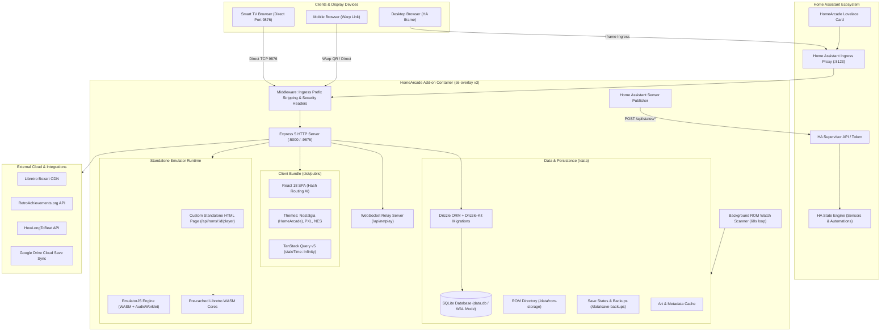
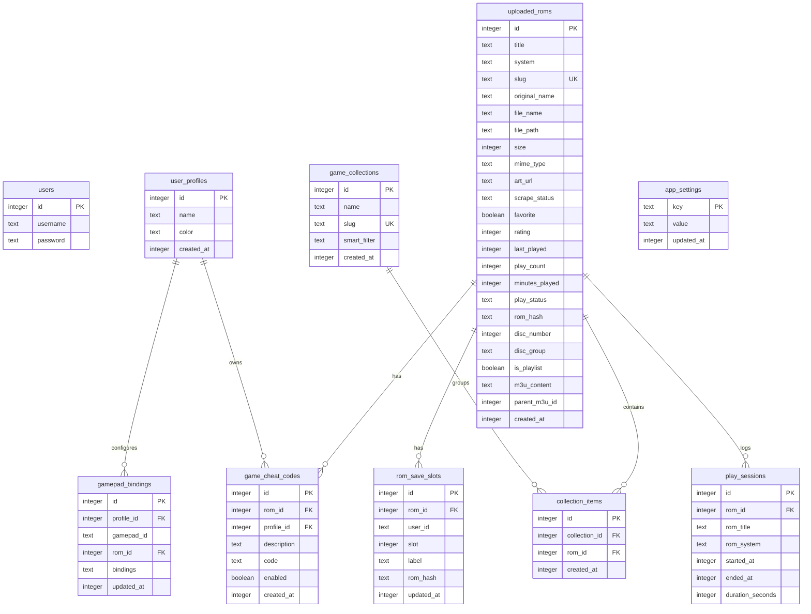

# HomeArcade — Documentation Initialization & Architectural Blueprint (INIT.md)

> **Document Version:** 1.0.0  
> **Project Version:** 2.51.0  
> **Target Platform:** Home Assistant Add-on (`amd64`, `aarch64`) & Standalone Web Server  
> **Repository:** `JMaroz/HomeArcade-HA`  
> **Last Updated:** October 2026

---

## 1. Executive Summary & Vision

**HomeArcade** is an all-in-one retro gaming server and frontend specifically architected to run as a **Home Assistant Add-on**, while maintaining the capability to serve games directly to Smart TVs, mobile devices, and desktop browsers.

### Core Objectives
1. **Zero-Configuration Home Assistant Integration**: Operate within Home Assistant Ingress (sandboxed iframe) with automatic authentication, user-identity detection, and automatic telemetry publishing to Home Assistant sensor entities.
2. **In-Browser WebAssembly Emulation**: Execute retro console games directly in the browser via **EmulatorJS** and pre-cached Libretro WASM cores without requiring external emulators or client software installations.
3. **Seamless Cross-Device Experience (Warp Link & TV Mode)**:
   - **Smart TV Access**: Direct port `9876` bypasses iframe restrictions for TV browsers, complete with D-pad navigation and auto-hiding virtual gamepads.
   - **Mobile Handoff (Warp Link)**: Instant QR-code scanning to migrate active play sessions with synced save states between desktop/TV and mobile devices.
4. **Autonomous Library Management**: Auto-detection of console platforms by file headers and signatures, multi-disc `.m3u` playlist generation, CUE/BIN pairing, directory watch scanners, zero-auth Libretro CDN art matching, and bulk vault maintenance (deduplication, space rebalancing, unplayed cleanup).
5. **Real-Time Multiplayer (Netplay)**: Built-in WebSocket signaling relay providing 6-character room codes for low-latency peer-to-peer rollback/lockstep synchronization.

---

## 2. System Architecture & High-Level Design

HomeArcade follows a **Triple-Layout Architecture** cleanly separating client, server, and shared definitions:

```
HomeArcade-HA/
├── cabinet_bridge/
│   ├── client/          # Single-Page Application (React 18 + Vite 7)
│   ├── server/          # Express 5 HTTP REST API + WebSocket Relay
│   ├── shared/          # Unified Drizzle ORM Schema, Zod Schemas & Constants
│   ├── migrations/      # Drizzle SQLite Migration Files
│   ├── rootfs/          # s6-overlay v3 Container Daemon Configs
│   ├── ejs_cache/       # Pre-packaged EmulatorJS WASM Cores & Assets
│   ├── bios/            # System BIOS storage
│   └── config.yaml      # Home Assistant Add-on Manifest
```

### Architectural Diagram



---

## 3. Technology Stack Breakdown

| Layer | Component | Version | Role / Rationale |
| :--- | :--- | :--- | :--- |
| **Runtime & Container** | Alpine Linux / HA Base | latest | Multi-arch base image (`ghcr.io/home-assistant/{arch}-base`) |
| | s6-overlay | v3 | Process supervision inside Docker container (`/rootfs`) |
| | Node.js | >= 20.x | Modern JavaScript runtime supporting ES modules and native fetch |
| | pnpm | 9.x | Strict, disk-efficient package manager |
| **Backend Framework** | Express | 5.2.1 | Next-gen HTTP framework handling REST APIs, streaming, and file uploads |
| | `better-sqlite3` | 11.10.0 | High-performance synchronous SQLite driver with WAL mode |
| | Drizzle ORM | 0.45.2 | Type-safe TypeScript ORM with zero-overhead queries |
| | Drizzle Zod | 0.7.1 | Automatic Zod schema derivation from database tables |
| | `ws` | 8.18.1 | High-performance WebSocket server for Netplay signaling |
| | `compression` | 1.8.1 | Gzip/Brotli response compression (bypassed for SSE streams) |
| **Frontend Framework** | React | 18.3.1 | Core UI view layer with concurrent rendering features |
| | Vite | 7.x | High-speed frontend tooling and bundler |
| | Wouter | 3.10.0 | Minimalist hash-based client routing (`#/`) required for HA iframes |
| | TanStack Query | 5.101.1 | Async state management and server synchronization |
| | Tailwind CSS | 3.4.x | Utility-first styling with custom dark-mode retro palettes |
| | Radix UI / shadcn | Latest | Accessible UI primitives (Dialogs, Dropdowns, Tabs, Tooltips) |
| | Framer Motion | 11.18.2 | Fluid spring animations, page transitions, and game carousels |
| | `i18next` | 23.16.8 | Full internationalization support (EN, FR, DE, ES, IT, etc.) |
| | `html5-qrcode` | 2.3.8 | In-browser camera scanning for Warp Link mobile pairing |
| **Emulation Core** | EmulatorJS | Stable | In-browser WebAssembly emulation bridge for Libretro cores |
| | WASM Cores | Pre-cached | NES, SNES, N64, Genesis, PS1, PS2, GBA, NDS, Dreamcast, Arcade, etc. |

---

## 4. Repository & Directory Structure

```
/Users/andrea/Repository/HomeArcade-HA/
├── AGENTS.md                  # Critical guidelines, commands, and active session state
├── HANDOFF.md                 # UI and routing architectural reference
├── LEARNED.md                 # Production post-mortems, bug analyses, and developer pitfalls
├── README.md                  # User-facing installation guide and release changelog
├── repository.yaml            # Home Assistant Add-on repository catalog definition
│
└── cabinet_bridge/            # Main application bundle
    ├── config.yaml            # Home Assistant add-on manifest (options, schema, ports, permissions)
    ├── Dockerfile             # Multi-stage production container build
    ├── package.json           # Pinned dependencies and operational scripts
    ├── pnpm-workspace.yaml    # Monorepo configuration
    ├── drizzle.config.ts      # Drizzle migration generator config
    ├── vite.config.ts         # Vite client bundler config
    ├── tailwind.config.ts     # Styling, theme colors, and animations
    │
    ├── bios/                  # Pre-installed / fallback BIOS images (e.g. SCPH-5500, GBA)
    ├── ejs_cache/             # Local offline mirror of EmulatorJS engine & WASM cores
    ├── migrations/            # SQL migration files generated by Drizzle Kit
    ├── rootfs/                # s6-overlay service definitions (`run` and `finish` scripts)
    ├── script/                # Build orchestration (`build.ts` uses Vite + esbuild CJS bundle)
    │
    ├── shared/                # Code shared between client and server
    │   ├── schema.ts          # SQLite database schema, Zod validation, and TypeScript types
    │   ├── bios-metadata.ts   # Checksums (MD5), filenames, and performance ratings for BIOS
    │   ├── system-images.ts   # Hardware console silhouettes and artwork URLs
    │   └── kylebing-icons.ts  # Console icon SVGs
    │
    ├── server/                # Backend API (Express 5 + SQLite)
    │   ├── index.ts           # Server entry point, middleware stack, port listener
    │   ├── storage.ts         # Database access layer and query repository
    │   ├── data-dir.ts        # Persistent storage locator (`/data` vs local override)
    │   ├── haPublisher.ts     # Home Assistant supervisor state pusher (sensor entities)
    │   ├── netplay.ts         # WebSocket Netplay room signaling server
    │   ├── scanner.ts         # Background filesystem watch scanner
    │   ├── hltb.ts            # HowLongToBeat scraper integration
    │   ├── google-drive.ts    # Google Drive cloud save sync integration
    │   ├── static.ts          # Static file serving with strict CORS/COOP/COEP headers
    │   ├── vite.ts            # Vite development middleware bridge
    │   └── routes/            # Modular Express route handlers
    │       ├── index.ts       # Route registry aggregating all sub-routes
    │       ├── roms.ts        # ROM uploads, move-all, stream endpoints, delete handlers
    │       ├── player.ts      # Dedicated HTML generator for the EmulatorJS page
    │       ├── vault.ts       # Health checks, storage snapshots, deduplication, unplayed clean
    │       ├── systems.ts     # System listings, metadata, and core assignments
    │       ├── scrape.ts      # Libretro CDN boxart scraper with fuzzy matching
    │       ├── bios.ts        # BIOS status check and missing BIOS auto-download
    │       ├── cheats.ts      # Game cheat code management
    │       ├── netplay.ts     # Netplay room stats & configuration
    │       ├── profiles.ts    # User profile creation and preference switches
    │       ├── gamepad.ts     # Controller mappings per profile and core
    │       ├── filesystem.ts  # Directory browsing for NAS/local storage selection
    │       └── shared.ts      # Shared constants (`ROM_ROOT`, `SAVE_BACKUP_DIR`, user extraction)
    │
    └── client/                # Frontend Application (React 18 + Vite 7)
        ├── index.html         # HTML root document
        ├── public/            # Public static assets, icons, and Lovelace card script
        └── src/
            ├── App.tsx        # Application root, HashRouter, providers, global banners
            ├── main.tsx       # DOM bootstrap and entry point
            ├── index.css      # Tailwind base layers, retro scrollbars, dark mode classes
            ├── pages/         # Top-level views
            │   ├── Dashboard.tsx    # Primary game browser and theme host
            │   ├── Player.tsx       # In-app emulator player container
            │   ├── Settings.tsx     # Comprehensive settings tabs
            │   ├── History.tsx      # Play history and duration statistics
            │   ├── Achievements.tsx # RetroAchievements profile and badge view
            │   └── settings/        # Individual settings panels (Library, Controls, Display, etc.)
            ├── components/    # Reusable UI widgets
            │   ├── GameCard.tsx           # Interactive game card with cover art & status
            │   ├── GameDetailDialog.tsx   # Central modal for launching, stats, saves, cheats
            │   ├── MoveAllRomsDialog.tsx  # Modal for bulk relocation of ROMs to new folders
            │   ├── RomUpload.tsx          # Drag-and-drop uploader with speed/ETA indicators
            │   ├── BiosManager.tsx        # Visual BIOS status checklist and download actions
            │   ├── ControllerRemapDialog.tsx # Visual button mapping tool for gamepads
            │   ├── StorageOverview.tsx    # Disk usage visualization & health tools
            │   ├── WarpLinkDialog.tsx     # QR code generator for instant mobile play
            │   ├── NowPlayingBar.tsx      # Persistent bottom bar showing active game session
            │   └── dashboard-themes/      # Dashboard layouts: HomeArcadeTheme, PxlTheme, NesTheme
            └── lib/           # Client utilities
                ├── queryClient.ts         # TanStack Query client configuration
                ├── integration.tsx        # Integration context connecting UI to backend
                ├── useGridNav.ts          # Gamepad / Keyboard D-pad navigation hook
                └── filter.ts              # Filter and sorting predicates for ROMs
```

---

## 5. Subsystems & Technical Mechanisms

### 5.1 Ingress Prefix Stripping & Routing
Home Assistant serves add-ons behind a reverse proxy located at dynamically generated paths such as `/api/hassio_ingress/<token>/`.
- **Server-side**: The very first Express middleware (`server/index.ts`) matches `INGRESS_PREFIX_RE` and slices the prefix from `req.url`. This ensures all subsequent Express route matches are clean root-relative paths (`/api/roms`, `/api/health`).
- **Client-side**: The React application utilizes **Wouter with Hash-based routing** (`Router hook={useHashLocation}`). The hash (`#/`) prevents path resolution collisions inside sandboxed Home Assistant iframes.

### 5.2 Direct TV Mode (Port 9876)
While Ingress is optimal for desktop Home Assistant dashboards, smart TVs (LG webOS, Samsung Tizen, Android TV) often suffer from strict iframe cookie policies, slow rendering, or lack of proper controller capture.
- `config.yaml` maps container port `5000` to host port `9876`.
- Accessing `http://<ha-ip>:9876` bypasses the Home Assistant Ingress wrapper completely.
- The player template (`server/routes/player.ts`) detects gamepad/remote usage:
  - Automatically hides virtual on-screen controls when a physical controller or TV remote is detected.
  - Inactivity timer (3 seconds) hides floating pause and menu buttons.
  - Native CSS `:focus-visible` styling enables smooth D-pad TV remote navigation across pause menus and save slots.

### 5.3 Emulation Layer & EmulatorJS Architecture
Emulation does not happen inside a React component. Navigating to `/play/:id` or accessing `/api/roms/:id/player` serves a **standalone, server-rendered HTML page**:
- **Why standalone?** Avoids React re-render penalties, memory leaks, and complex WebAssembly lifecycle conflicts.
- **Cross-Origin Isolation**: Required headers (`Cross-Origin-Embedder-Policy: require-corp` and `Cross-Origin-Opener-Policy: same-origin`) are injected specifically on player endpoints to unlock `SharedArrayBuffer` for multi-threaded cores like N64, PSP, and PS1.
- **Save States**: Save states are captured via EmulatorJS hooks and posted back to `/api/roms/:id/save-slot` with metadata, slot indexes, and MD5 ROM verification.

### 5.4 ROM Management & Multi-Disc Engine
- **Upload Intelligence**: SNI/binary sniffing inspects magic bytes to identify platforms regardless of file extension. Supports nested folder uploads, auto-grouping `.cue` and `.bin` tracks.
- **Multi-Disc M3U Playlists**: When multiple discs are uploaded (e.g. `Final Fantasy VII (Disc 1).chd`, `(Disc 2).chd`), HomeArcade creates an M3U playlist entry in SQLite and disk, grouping siblings under `disc_group` and tracking child ROMs via `parentM3uId`.
- **Bulk Migration (`/api/roms/move-all`)**: Moves all ROM files to any selected folder organized by system subdirectories, updates database records, and rewrites relative paths within `.m3u` files atomically.

### 5.5 Home Assistant Telemetry (`haPublisher.ts`)
The server acts as an active telemetry source for Home Assistant:
- Obtains the internal **Supervisor Token** (`SUPERVISOR_TOKEN` environment variable).
- Emits real-time state changes via `POST http://supervisor/homeassistant/api/states/<entity_id>`:
  - `sensor.homearcade_game`: Name of currently running game (or `"idle"`).
  - `sensor.homearcade_system`: Console identifier (e.g., `snes`, `ps1`).
  - `sensor.homearcade_player`: Active user profile name.
  - `sensor.homearcade_play_count`: Total sessions recorded.
  - `binary_sensor.homearcade_active`: `"on"` during active gameplay, `"off"` otherwise.
- Allows Home Assistant users to build automations: dimming game-room lights upon launch, switching TV HDMI inputs, or changing LED light colors to match the console theme.

### 5.6 Multiplayer Netplay Relay (`netplay.ts`)
- Standalone WebSocket server running on `/api/netplay`.
- Pairs players using short 6-character alphanumeric room codes (`ABCDEF`).
- Disables Nagle's algorithm (`_socket.setNoDelay(true)`) and turns off deflate compression for instant, low-overhead controller packet relaying between Host and Client peers.

### 5.7 Zero-Auth Metadata Scraper (`scrape.ts`)
- Pulls authentic box art and covers from Libretro's public CDN (`thumbnails.libretro.com`).
- Features in-memory TTL caching of directory listings and string comparison scoring (exact, substring, token overlap with stop-word removal) to accurately match messy ROM filenames against official Libretro naming conventions.

---

## 6. Database Schema Reference (SQLite / Drizzle)

The SQLite database resides at `/data/data.db` (or local working directory in dev) and is managed via **Drizzle ORM**.



---

## 7. Primary REST API & WebSocket Catalog

### Core Endpoints

| Method | Endpoint | Description |
| :--- | :--- | :--- |
| `GET` | `/api/health` | Add-on health probe (returns `"ok"` or `"starting"`) |
| `GET` | `/api/debug` | Runtime environment diagnostic dump |
| `GET` | `/api/roms` | List all scanned and uploaded ROMs |
| `POST` | `/api/roms/upload` | Multipart file upload for ROMs and multi-disc packages |
| `GET` | `/api/roms/move-stats` | Storage metrics and preview before executing bulk relocation |
| `POST` | `/api/roms/move-all` | Bulk relocation of all ROMs to a target directory |
| `POST` | `/api/roms/move-cleanup` | Cleans up empty directories in the old storage path |
| `GET` | `/api/roms/:id` | Detailed metadata for a single game |
| `PATCH` | `/api/roms/:id` | Update game metadata (title, rating, favorite, status) |
| `DELETE`| `/api/roms/:id` | Delete ROM file from disk and remove database entry |
| `GET` | `/api/roms/:id/player` | Serves the standalone EmulatorJS player HTML page |
| `GET` | `/api/roms/:id/content` | Streams the raw ROM binary to the emulator engine |
| `GET` | `/api/roms/:id/save-slot/:slot` | Downloads binary save state for a given slot |
| `POST` | `/api/roms/:id/save-slot/:slot` | Uploads binary save state for a given slot |

### Vault & Health Endpoints

| Method | Endpoint | Description |
| :--- | :--- | :--- |
| `GET` | `/api/vault/health` | Library statistics: missing art, missing metadata, unplayed games |
| `GET` | `/api/vault/storage-snapshot` | Detailed breakdown of storage usage across systems and drives |
| `POST` | `/api/vault/dedup` | Database deduplication (preserves earliest entry per MD5 hash) |
| `POST` | `/api/vault/delete-unplayed` | Bulk deletion of unplayed ROMs (with optional `?system=` filter) |
| `POST` | `/api/vault/delete-failed` | Deletes ROMs with unresolved or failed scrape status |

### Systems, BIOS & Settings

| Method | Endpoint | Description |
| :--- | :--- | :--- |
| `GET` | `/api/systems` | List of supported hardware systems, core definitions, and art |
| `GET` | `/api/bios/status` | Verification report of installed vs required BIOS files |
| `POST` | `/api/bios/download/:core` | Auto-download missing BIOS files from verified repositories |
| `GET` | `/api/settings/integration` | Fetch system configuration (HA URL, watch paths, controls) |
| `POST` | `/api/settings/integration` | Save system configuration to SQLite |
| `GET` | `/api/filesystem/browse` | Browse directories for mounting external ROM storage |
| `WS` | `/api/netplay` | WebSocket signaling endpoint for EmulatorJS multiplayer rooms |

---

## 8. Build, Development & Release Workflows

### 8.1 Local Development Setup

> [!WARNING]
> **macOS AirPlay Conflict**: macOS Monterey and newer bind port `5000` to AirPlay Receiver. Always use `PORT=5001 pnpm dev` when developing on macOS to prevent `EADDRINUSE`.

```bash
# Navigate to add-on package directory
cd cabinet_bridge

# Install dependencies using pnpm
pnpm install

# Start local dev server (port 5001 to avoid AirPlay conflict)
PORT=5001 pnpm dev
```

### 8.2 Common Scripts

```bash
# Type check TypeScript code across client, server, and shared
pnpm check

# Execute Vitest test suites (server, client, shared)
pnpm test

# Run End-to-End Playwright test suite
pnpm test:e2e

# Push Drizzle schema changes to local SQLite database
pnpm db:push

# Build production artifacts (Vite -> dist/public, esbuild -> dist/index.cjs)
pnpm build

# Start production server locally
pnpm start
```

### 8.3 Release Synchronization Rule

When creating a new release or bumping versions, **both files must always be updated simultaneously**:
1. `cabinet_bridge/package.json` (`"version": "X.Y.Z"`)
2. `cabinet_bridge/config.yaml` (`version: "X.Y.Z"`)

Failing to update both files causes cache mismatches in Home Assistant Supervisor and breaks CI deployment checks (`release-health.test.ts`).

---

## 9. Critical Pitfalls & Engineering Rules (Tribal Knowledge)

These guidelines have been derived from real production bugs and post-mortems documented in `LEARNED.md`:

1. **Express Route Registration Order**:
   - Express evaluates routes sequentially.
   - **Static routes MUST ALWAYS be registered before parameterized routes**.
   - *Example*: Register `/api/roms/move-stats` before `/api/roms/:id`, otherwise the string `"move-stats"` is evaluated as `:id`, returning a 404 or NaN error.
2. **Esbuild CJS Single-File Bundler Inlining**:
   - `build.ts` compiles the entire server into a single CommonJS file (`dist/index.cjs`).
   - Circular imports or shared utility chains across layers (`storage.ts -> routes/utils.ts`) can break bindings at bundle time.
   - Prefer duplicating small utility functions or keeping them in pure leaf modules.
3. **Docker Layer Caching in Home Assistant Supervisor**:
   - Docker layer caching can silently reuse stale server bundles if only source files change without busting the Docker layer.
   - The Dockerfile utilizes an explicit `ARG CACHE_BUST=X` and version checks to ensure fresh compiles.
4. **TanStack Query Default `staleTime: Infinity`**:
   - The client query client configures `staleTime: Infinity` and `retry: false` to reduce network chatter in iframe environments.
   - Components must defensively check values using optional chaining (`?.`) and nullish coalescing (`?? 0`). Never assume response shapes are populated without verifying.
5. **No Iframe LocalStorage / Cookie Reliance**:
   - Browsers frequently partition or wipe cookies and LocalStorage for sandboxed iframes.
   - All settings and user preferences **must be persisted in the backend SQLite database** via `/api/settings/integration`.

---

## 10. Documentation Index & Future Roadmap

This file serves as the root index for technical documentation. As the project expands, supplementary deep-dive documents will reside in this `docs/` directory:

- [x] `docs/INIT.md`: Master Architecture, Subsystems, Schema & Developer Onboarding (this document).
- [ ] `docs/NETPLAY.md`: Protocol specifications and latency benchmarks for WebSockets.
- [ ] `docs/EMULATOR_CORES.md`: Compatibility matrix, core configurations, and WebAssembly compiler flags.
- [ ] `docs/HOME_ASSISTANT_INGRESS.md`: Deep-dive into supervisor authentication, token refresh, and Lovelace integration.
